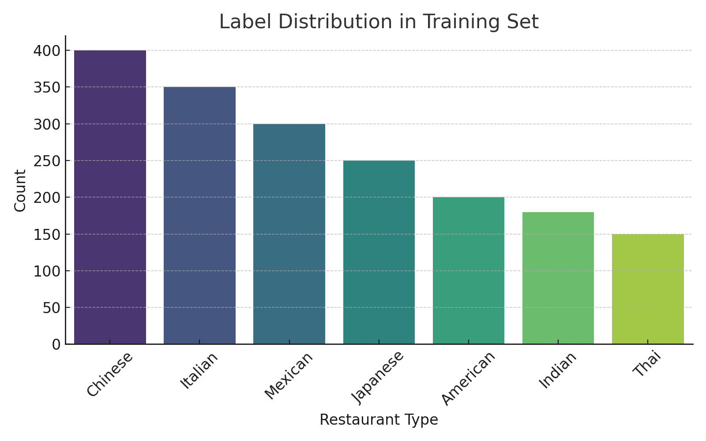
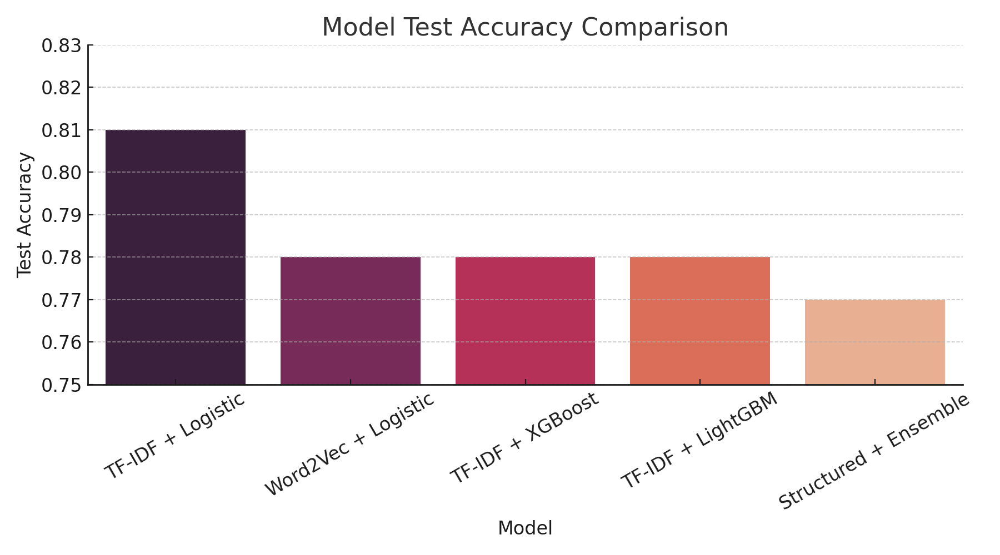

# NLP Restaurant Prediction
I am attempting to predict the ethnic type of restaurants based on a variety of columns in the dataset. The most important column includes yelp reviews of the various restaurants, which is where NLP comes into play. 

# Restaurant Type Prediction with Text and Metadata

This project tackles a classification task using a dataset of restaurants and their reviews. The goal is to **predict the type of restaurant** based on both **free-text reviews** and structured attributes (hours, location, features, etc.).

Our best model achieves **81% validation accuracy**, significantly outperforming the baseline provided.

---

## Dataset Overview

### `train.csv`
- Contains labeled restaurant examples
- Features include:
  - Free-text review (`review`)
  - Categorical fields (e.g., `attributes.WiFi`, `hours.Thursday`)
  - Numeric fields (e.g., `stars`, `review_count`)
  - Label: `label` (target class)
 
#### Label Distribution in Training Set

### `test.csv`
- Same structure, but without the label column
- Used for generating final predictions

---

# Preprocessing & Feature Engineering

The preprocessing stage began with cleaning the review text data. Each review was lowercased, stripped of punctuation, and tokenized into words. English stopwords were removed to reduce noise and retain only the most informative terms. The cleaned tokens were stored in a new column called tokens for downstream processing.

Structured features such as postal_code, hours.*, and attributes.* were examined and selectively removed based on sparsity or redundancy. In particular, columns with fewer than 10,000 non-null entries were dropped to focus on higher-quality features. Additional cleanup involved decoding byte-string values (e.g., from b'text' to text) and identifying which columns were categorical or numeric. Categorical columns were prepared for one-hot encoding, while numeric columns were scaled using standard normalization.

For the text data, two main feature engineering approaches were applied. First, a Word2Vec model was trained on the tokenized reviews using the skip-gram architecture. The resulting word embeddings were averaged across tokens to form fixed-length document vectors, which were used as input to a logistic regression classifier. This model achieved a test accuracy of approximately 0.78.

The second, and most effective, approach involved transforming the cleaned reviews using a TF-IDF vectorizer, capturing both unigrams and bigrams. The resulting sparse matrix was then fed into a logistic regression model with L2 regularization. This model outperformed all others, achieving the highest test accuracy of approximately 0.81.

Additional experiments incorporated structured features into ensemble models using XGBoost, LightGBM, and a soft-voting classifier that combined logistic regression, random forest, and XGBoost. However, these models generally performed slightly worse, with test accuracies in the 0.77–0.78 range. This suggested that the text-based features, when carefully processed and vectorized using TF-IDF, carried the most predictive power for the restaurant classification task.

#### Model Test Accuracy Comparison

## Conclusion

The **TF-IDF + Logistic Regression** model emerged as the top-performing approach in this project, achieving a test accuracy of **81%**, outperforming more complex alternatives like XGBoost, LightGBM, and ensemble classifiers that incorporated structured features.

There are several reasons why this model performed best:

- **Strong Signal in Text Reviews:**  
  The restaurant reviews contain rich, descriptive language that often directly references cuisine type, dishes, or dining experience. This makes the text data inherently predictive of the restaurant label, more so than metadata like opening hours or WiFi availability.

- **TF-IDF Captures Key Discriminative Phrases:**  
  Unlike Word2Vec, which averages over word meanings and may dilute discriminative words, TF-IDF emphasizes terms that are both frequent within a document and rare across documents. This helps capture label-specific terms like "sushi", "tikka", or "tortilla", which are highly indicative of restaurant type.

- **Logistic Regression’s Simplicity and Effectiveness:**  
  Logistic regression is a linear model that works well in high-dimensional sparse spaces—precisely the output of a TF-IDF vectorizer. It also benefits from fast training, interpretable weights, and reliable regularization to prevent overfitting.

- **No Need for Additional Complexity:**  
  More sophisticated models like XGBoost or neural embeddings did not yield gains, likely due to the relatively small number of samples per class and the noise or sparsity in structured features. In contrast, the TF-IDF approach directly leverages the strongest signal—cleaned, descriptive review text.

In summary, the combination of **clean textual input**, **TF-IDF’s discriminative power**, and **logistic regression’s robustness** made this model the best choice for this classification task.